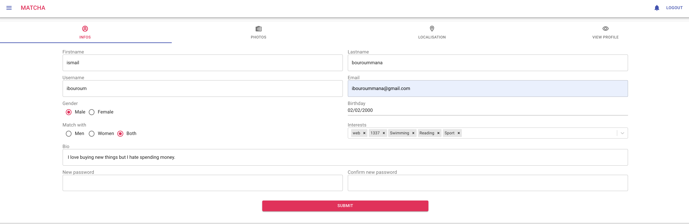
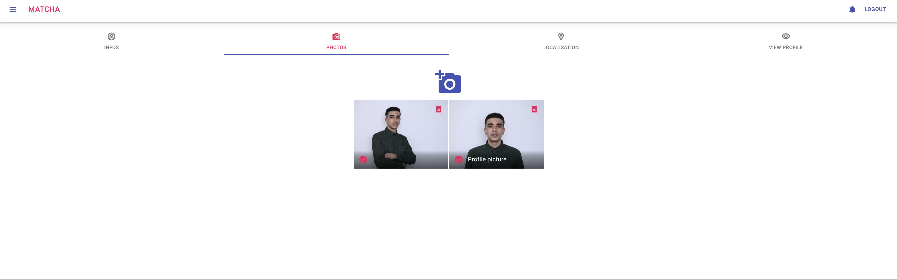
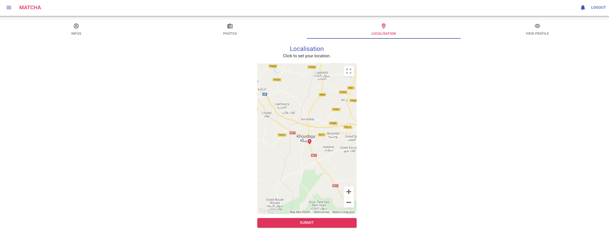
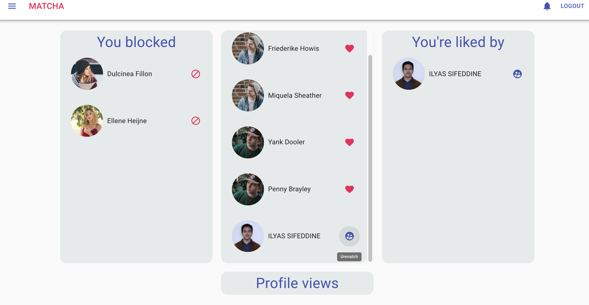
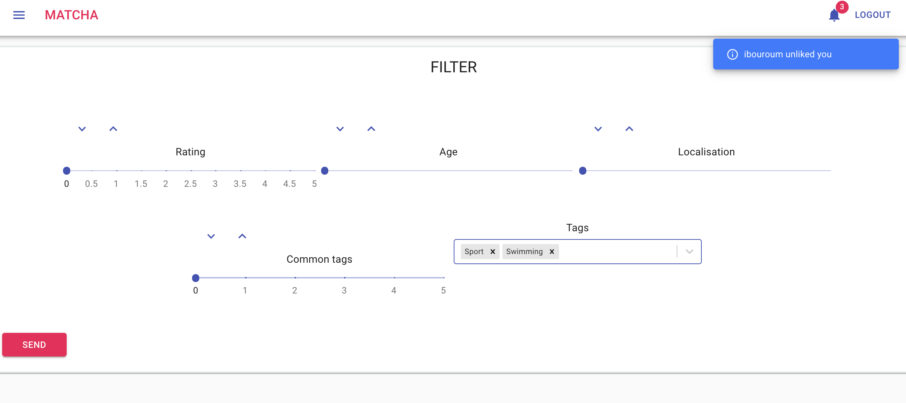
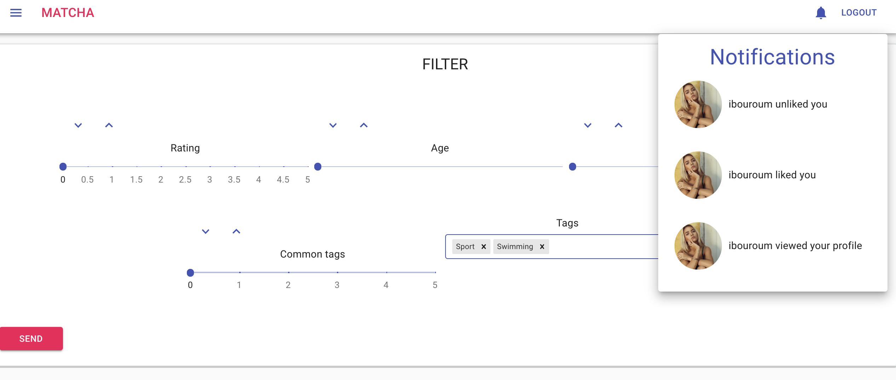
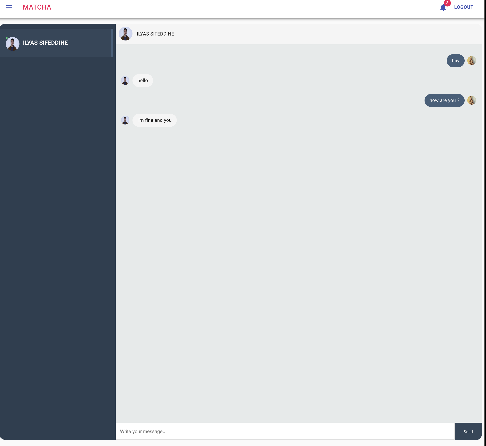

# Matcha
  A dating website - 1337 school (42 network) project.
# Description
  A web app where users can interact with each other.
The user can create his account, and after completing his profile he can search for other users by age, distance, rating, common tags.
With the possibility to like, block or report fake accounts. Two matched users can chat with each other.
# Features
  * Like/unlike, block and report users.
  * Search and filter users.
  * Realtime chat with matched users.
  * Realtime notifications when: a like is received, the user is matched with another one, the users's profile is viewed, a message is received, a matched user unliked.
# Front-end
  * React.js (+hooks)
  * Redux (+ Redux form, Redux-saga)
  * Material-ui
# Back-end
  * Node.js
  * Express.js
  * Socket.io
  * MYSQL
# Prerequisites
  node, npm
# Running the app
```
cd client && npm install
cd server && npm install
cd server/database && and sh index.sh //to launch db migration
cd server && npm run dev
cd client && serve -s build -l [PORT]
```
# Pictures
* User profile



* Browse


* Activity

* Notification


* Chat

# Authors
ISMAIL BOUROUMMANA & ILYAS SIFEDDINE 
